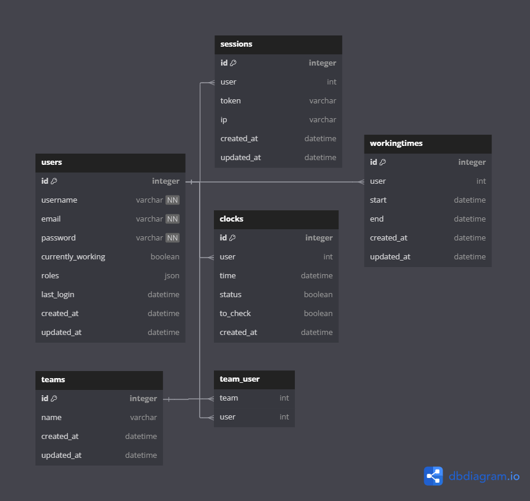

# TimeManager - T-POO-700-NAN_6

## Table of contents
1. [Prerequisites](#prerequisites)
2. [Setup and configuration](#setup-and-configuration)
3. [Technologies](#technologies)
4. [Authors](#authors)
5. [DBDiagram](#dbdiagram)

## Prerequisites

- [Docker](https://docs.docker.com/get-docker/)

## Setup and configuration

#### Open a terminal and clone the repository
```bash
$ git clone git@github.com:EpitechMscProPromo2026/T-POO-700-NAN_6.git
$ cd T-POO-700-NAN_6
```

#### Open a terminal and run the following commands:
Run project in production mode with local Dockerfile
```bash
$ make build ENV=local
# Wait for the containers to be ready
# Go to http://localhost
# Enjoy the app!
```

Run project in production mode with public image
```bash
$ make build ENV=prod
# Wait for the containers to be ready
# Go to http://localhost
# Enjoy the app!
```

Run project in development mode 
```bash
$ make build
# Wait for the containers to be ready
# Go to http://localhost:4000
# Enjoy the app!
```

To test the application, you can run this command for dummy data
```bash
$ make seeds
# Run this command after build app
```

## Cordova
You should have installed all requirements of cordova.

Set the **IP address** of your elixir API  into /app/src/services/apiClient.ts, in the baseUrl property

Build VueJS app into cordova : 

```bash
$ cd app
$ npm run build:cordova
```

Add android platform to the cordova project :

```bash
$ cd timemanager-mobile
$ cordova platform add android
```

To build, install and run the APK on a device, you should have a connected device or an android emulator which is running.
Then, run this command : 

```bash
$ cordova run android
```


## Cypress
⚠️ If you are using a linux environment, you should maybe install cypress globally

```bash
$ sudo npm i cypress -g
```


To run e2e tests, we advice you to run the make build in local environment, and run seeds : 

```bash
$ make build ENV=local
$ make seeds
```

Run e2e tests in headless mode : 

```bash
$ npm run test:e2e
```

If you want to open Cypress, and run a specific test file : 

```bash
$ npm run test:e2e:dev 
```

#### Logins and passwords
| username | email | Password |
| --- | --- | --- |
| supermanager | supermanager@epitech.eu | azertyuiop
| manager | manager@epitech.eu | azertyuiop
| employee | employee@epitech.eu | azertyuiop

## Technologies
    

## Authors

- Valentin RAGOT
- Ziyad EL-HILA
- Rafi ZAKARIA
- Mohamed AZDOUD

### DBDiagram

